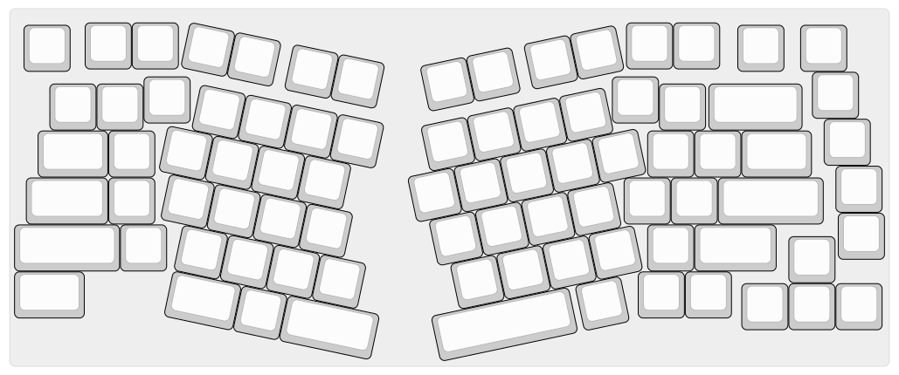

# V-75
A custom ergonomic split 75% keyboard.

Currently a case has not been designed.

## PCB
The PCB is controlled by the Seeed Studio XIAO RP2040.
The keys are controlled by two I2C Keypad controllers, combined with a multiplexer to connect to the microcontroller.
## Layout
Layout is based on [adelheid-plus](https://github.com/dcpedit/adelheid-plus), which itself is based on [adelheid](https://github.com/floookay/adelheid)

